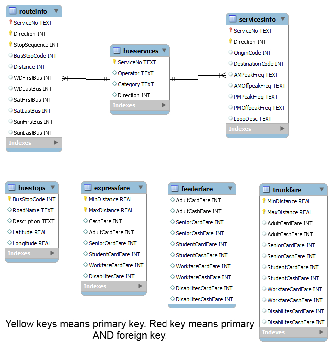

# Documentation

This is a WIP documentation.

## Database Model



## UML Diagram

![UML DIAGRAM](https://mermaid.ink/img/eyJjb2RlIjoiY2xhc3NEaWFncmFtXG4gICAgY2xhc3MgRGF0YXN0b3JlIHtcbiAgICAgICAgK1N0cmluZyB1cmlcbiAgICAgICAgK2dldF9jb25uKHVyaTogc3RyKSBvYmplY3RcbiAgICAgICAgK2dldF9yZWNvcmQoY29tbWFuZDogc3RyLCBwYXJhbTogdHVwbGUpIGRpY3RcbiAgICAgICAgK2dldF9yZWNvcmRzKGNvbW1hbmQ6IHN0ciwgcGFyYW06IHR1cGxlKSBkaWN0XG4gICAgICAgICtkaXN0YW5jZV9wYXJzZXIocmF3X2Rpc3RhbmNlOiBzdHIpIHN0clxuICAgICAgICArdGFibGVzX2luaXQoKVxuICAgICAgICArZmFyZV9pbml0KClcbiAgICAgICAgK2J1c19pbml0KClcbiAgICAgICAgK2luaXRfYWxsKClcbiAgICB9XG4gICAgY2xhc3MgRmVhdHVyZSB7XG4gICAgICAgICtPYmplY3QgZGJcbiAgICAgICAgK2dldF9yZWNvcmQoY29tbWFuZDogc3RyLCBwYXJhbTogdHVwbGUpIGRpY3RcbiAgICAgICAgK2dldF9yZWNvcmRzKGNvbW1hbmQ6IHN0ciwgcGFyYW06IHR1cGxlKSBkaWN0XG4gICAgfVxuICAgIEZlYXR1cmUgPHwtLSBOZWFyZXN0QnVzXG4gICAgRmVhdHVyZSA8fC0tIEZhcmVDYWxjdWxhdG9yXG4gICAgY2xhc3MgTmVhcmVzdEJ1cyB7XG4gICAgICAgICtnZXRCdXNTdG9wcyhsYXRpdHVkZTogc3RyLCBsb25naXR1ZGU6IHN0ciwgcmVjb3JkbWF4OiBzdHIpIGxpc3RcbiAgICB9XG4gICAgY2xhc3MgRmFyZUNhbGN1bGF0b3Ige1xuICAgICAgICArZ2V0RGlyZWN0aW9ucyhzZXJ2aWNlbm86IHN0cikgbGlzdFxuICAgICAgICArZ2V0Qm9hcmRpbmdBdChkaXJlY3Rpb246IHN0ciwgc2VydmljZW5vOiBzdHIpIGxpc3RcbiAgICAgICAgK2dldEFsaWdodGluZ0F0KGRpcmVjdGlvbjogc3RyLCBzZXJ2aWNlbm86IHN0ciwgYm9hcmRpbmdubzogc3RyKSBsaXN0XG4gICAgICAgICtjYWxjdWxhdGVGYXJlKGZhcmV0eXBlOnN0ciwgZGlyZWN0aW9uOiBzdHIsIHNlcnZpY2Vubzogc3RyLCBib2FyZGluZ25vOiBzdHIpIGxpc3RcbiAgICB9XG4gICAgY2xhc3MgVmFsaWRhdGlvbiB7XG4gICAgK2lzRmxvYXQoKmFyZ3M6IHR1cGxlKSBib29sXG4gICAgK2lucHV0Q2hlY2socGFyYW1zRGljdCkgYm9vbFxuICAgICtzZWxlY3RDaGVjaygqb3B0aW9uczogdHVwbGUpIGJvb2xcbiAgICB9IiwibWVybWFpZCI6eyJ0aGVtZSI6Im5ldXRyYWwifSwidXBkYXRlRWRpdG9yIjpmYWxzZX0)]

### Mermaid UML Code
```
classDiagram
    class Datastore {
        +String uri
        +get_conn(uri: str) object
        +get_record(command: str, param: tuple) dict
        +get_records(command: str, param: tuple) dict
        +distance_parser(raw_distance: str) str
        +tables_init()
        +fare_init()
        +bus_init()
        +init_all()
    }
    class Feature {
        +Object db
        +get_record(command: str, param: tuple) dict
        +get_records(command: str, param: tuple) dict
    }
    Feature <|-- NearestBus
    Feature <|-- FareCalculator
    class NearestBus {
        +getBusStops(latitude: str, longitude: str, recordmax: str) list
    }
    class FareCalculator {
        +getDirections(serviceno: str) list
        +getBoardingAt(direction: str, serviceno: str) list
        +getAlightingAt(direction: str, serviceno: str, boardingno: str) list
        +calculateFare(faretype:str, direction: str, serviceno: str, boardingno: str) list
    }
    class Validation {
    +isFloat(*args: tuple) bool
    +inputCheck(paramsDict) bool
    +selectCheck(*options: tuple) bool
    }
```